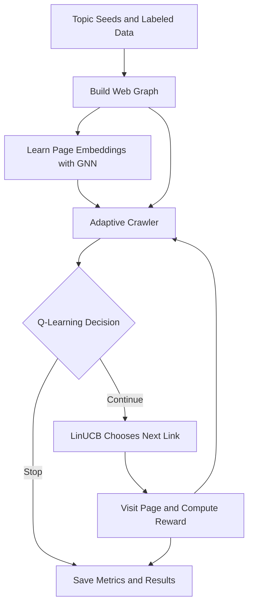

# Adaptive Q-Learning Web Crawler

Research implementation of a focused web crawler that combines adaptive Q-learning, LinUCB contextual bandits, and graph neural network embeddings for topic-directed crawl decisions.

The repository is organized for reproducible experimentation: seeded datasets, train/validation/test labels, model checkpoints, evaluation scripts, phase reports, and benchmark outputs are included under versioned project folders.

Research paper: [`docs/paper/adaptive_qlearning_web_crawler.pdf`](docs/paper/adaptive_qlearning_web_crawler.pdf)

## Paper

| Field | Details |
| --- | --- |
| Title | Adaptive Q-Learning Web Crawler |
| Authors | Vasant Kumar Mogia, Sujal Jariha |
| PDF | [`docs/paper/adaptive_qlearning_web_crawler.pdf`](docs/paper/adaptive_qlearning_web_crawler.pdf) |
| Citation metadata | [`CITATION.cff`](CITATION.cff) |

## Problem Statement

Focused web crawling tries to maximize the number of topic-relevant pages discovered under a limited crawl budget. Static policies such as random crawling, best-first heuristics, or PageRank-based traversal can waste requests when topical relevance depends on page context, link anchor text, and graph structure.

This project formulates crawling as a sequential decision problem:

- The crawler observes the current page, graph neighborhood, remaining budget, and historical rewards.
- A Q-learning policy decides whether to continue or stop.
- A contextual bandit ranks candidate outgoing links when continuing.
- A frozen GraphSAGE encoder supplies structural page embeddings from the bootstrap web graph.

The research question is whether an adaptive policy can improve harvest rate and average reward over non-adaptive baselines while staying practical on CPU-only student hardware.

## Methodology

### State Design

The Q-learning state is a 69-dimensional vector:

| Component | Dimensions | Description |
| --- | ---: | --- |
| GNN embedding | 64 | Frozen GraphSAGE representation for the current URL |
| Budget remaining | 1 | Normalized remaining page budget |
| Relevant pages found | 1 | Normalized cumulative relevant discoveries |
| Current depth | 1 | Normalized crawl depth |
| Average reward | 1 | Clipped running reward signal |
| Exploration rate | 1 | Current epsilon value |

Candidate link contexts use 174 dimensions:

| Component | Dimensions | Description |
| --- | ---: | --- |
| GNN embedding | 64 | Structural embedding |
| URL features | 20 | Depth, domain, query, file type, path markers |
| Content features | 50 | TF-IDF and HTML/content statistics |
| Anchor features | 30 | Anchor text statistics and topic keyword indicators |
| Graph features | 10 | In-degree, out-degree, PageRank, hub/leaf indicators |

### Action Design

The Q-agent uses two high-level actions:

| Action | Meaning |
| --- | --- |
| `0` | Stop the crawl episode |
| `1` | Continue crawling and delegate link choice to LinUCB |

When action `1` is selected, LinUCB scores each candidate link using its 174-dimensional context and chooses the maximum upper-confidence score.

### Reward Design

Rewards are computed from topical relevance, novelty, fetch cost, depth, and duplicate penalties:

| Event | Reward effect |
| --- | ---: |
| Highly relevant page | `+10` |
| Moderately relevant page | `+5` |
| Low/irrelevant page | `0` to `-2` |
| New domain | `+2` |
| Duplicate page | `-5` |
| Fetch time | `-0.1 * fetch_time` |
| Crawl depth | `-0.1 * min(depth, 10)` |

The training loop also rewards useful stopping behavior and penalizes early stops or dead ends.

### Update Rules

Q-learning updates the crawler after each action by comparing the reward it expected with the reward it actually received. Over repeated episodes, this teaches the agent when it is worth continuing a crawl and when stopping is better.

LinUCB updates its link-selection confidence after every selected link. Links with good rewards become more attractive, while uncertain links can still be explored when the model needs more evidence.

The GraphSAGE encoder is pre-trained on the bootstrap graph with binary relevance labels, then frozen for active crawling to keep evaluation CPU-friendly.

## Architecture



In simple words, the system has two parts: preparation before crawling and decisions during crawling.

1. The project starts with topic seeds and labeled URLs.
2. Those URLs are used to build a web graph, which is a map of pages and links.
3. The GNN studies that map and turns each page into a compact embedding.
4. During crawling, the adaptive crawler uses the graph and embeddings as context.
5. Q-learning makes the high-level decision: stop or continue.
6. If it continues, LinUCB picks the best next link from the available candidates.
7. The crawler visits the selected page and receives a reward based on relevance, novelty, depth, and cost.
8. The reward improves future decisions, and the evaluator saves the final metrics and result files.

The main idea is simple: the GNN helps the crawler understand page structure, Q-learning controls the overall crawl strategy, and LinUCB chooses the next link when the crawler decides to continue.

## Repository Layout

| Path | Purpose |
| --- | --- |
| `src/` | Core crawler, models, graph utilities, reward and evaluation code |
| `experiments/` | Bootstrap, training, live crawl, and evaluation scripts |
| `configs/crawler_config.yaml` | Main experiment configuration and hyperparameters |
| `data/seeds/` | Topic seed URLs for ML, climate, and blockchain domains |
| `data/target_domains/` | Labeled URL dataset and train/val/test splits |
| `data/graphs/` | Bootstrap graph artifact |
| `data/models/` | GNN, Q-learning, and bandit checkpoints |
| `data/results/` | Evaluation JSON/Markdown reports |
| `docs/` | Design notes, walkthroughs, phase reports, and detailed explanations |
| `docs/paper/` | Research paper PDF |
| `train.py` | Reproducible root training wrapper |
| `evaluate.py` | Reproducible root evaluation wrapper |

## Experimental Setup

### Datasets

The included sample dataset targets three topical domains:

| Topic | Seed file | Label data |
| --- | --- | --- |
| Machine learning | `data/seeds/ml_seeds.json` | `data/target_domains/*.csv` |
| Climate | `data/seeds/climate_seeds.json` | `data/target_domains/*.csv` |
| Blockchain | `data/seeds/blockchain_seeds.json` | `data/target_domains/*.csv` |

Current labeled split:

| Split | File |
| --- | --- |
| Train | `data/target_domains/train_labeled.csv` |
| Validation | `data/target_domains/val_labeled.csv` |
| Test | `data/target_domains/test_labeled.csv` |

To regenerate the bootstrap graph and labeling template:

```bash
python experiments/bootstrap_graph.py
python experiments/create_labeled_data.py
```

After manual labeling, rebuild train/validation/test splits:

```bash
python experiments/create_labeled_data.py --split
```

### Metrics

Evaluation reports the following metrics:

| Metric | Definition |
| --- | --- |
| Harvest rate | Relevant pages found / total pages crawled |
| Precision@10 | Relevant pages in the first 10 crawled pages |
| Precision@20 | Relevant pages in the first 20 crawled pages |
| Average reward | Mean reward per crawled page |
| Crawl time | Wall-clock runtime per crawler run |

### Baselines

The evaluator compares:

- `random`
- `best_first`
- `pagerank`
- `pure_q`
- `pure_bandit`
- `hybrid_no_gnn`
- `hybrid`

## Results Summary

Canonical strict benchmark: `data/results/PHASE_7_FINAL_STRICT.md`

Command used:

```bash
python experiments/evaluate_baseline.py --max-pages 10 --runs-per-seed 2 --max-seeds-per-topic 2 --random-seed 42 --output-prefix PHASE_7_FINAL_STRICT
```

| Crawler | Harvest Rate | P@10 | P@20 | Avg Reward | Crawl Time (s) |
| --- | ---: | ---: | ---: | ---: | ---: |
| random | 0.108 +/- 0.029 | 0.108 | 0.108 | 0.55 | 21.84 |
| best_first | 0.133 +/- 0.078 | 0.133 | 0.133 | 0.84 | 22.50 |
| pagerank | 0.100 +/- 0.000 | 0.100 | 0.100 | 0.48 | 19.06 |
| pure_q | 0.958 +/- 0.144 | 0.958 | 0.958 | 11.21 | 2.77 |
| pure_bandit | 0.100 +/- 0.000 | 0.100 | 0.100 | 0.45 | 27.29 |
| hybrid_no_gnn | 1.000 +/- 0.000 | 1.000 | 1.000 | 11.72 | 2.56 |
| hybrid | 0.117 +/- 0.044 | 0.117 | 0.117 | 0.69 | 25.65 |

Interpretation: the strongest production policy in this snapshot is `hybrid_no_gnn`, with `pure_q` as a fallback. The full `hybrid` path remains experimental; diagnostics in `data/results/PHASE_7_DIAG_STRICT.md` show second-step LinUCB selections repeatedly choosing irrelevant pages.

Plots are not committed in this snapshot. Reproducible result tables and raw metrics are available as JSON/Markdown under `data/results/`; model checkpoints are under `data/models/`.

## Known Limitations

- Live crawling results can change because websites update, block requests, go offline, or respond slowly.
- Network conditions affect crawl time and sometimes the number of pages successfully fetched.
- The full `hybrid` policy is still experimental in this snapshot; the current strongest policy is `hybrid_no_gnn`, with `pure_q` as a fallback.
- The included dataset is intentionally small and student-budget friendly, so results should be treated as a reproducible project benchmark rather than a large-scale web benchmark.
- Plots are not included in this snapshot, but raw JSON and Markdown result tables are available under `data/results/`.

## Ethical Crawling

This project is intended for research and educational use. The crawler uses conservative settings such as request delays, timeouts, page budgets, and candidate limits to avoid aggressive crawling.

When running live crawls:

- Respect website terms of service and robots policies.
- Keep crawl budgets small unless you have permission.
- Use the configured delay in `configs/crawler_config.yaml`.
- Do not use the crawler for scraping private, sensitive, login-protected, or copyrighted content at scale.
- Report experiments with the exact command, random seed, date, and network conditions when possible.

## How To Run

### 1. Create the environment

Linux/macOS:

```bash
python -m venv venv
source venv/bin/activate
python -m pip install --upgrade pip
pip install -r requirements.txt
```

Windows PowerShell:

```powershell
python -m venv venv
.\venv\Scripts\Activate.ps1
python -m pip install --upgrade pip
pip install -r requirements.txt
```

Conda alternative:

```bash
conda env create -f environment.yml
conda activate adaptive-qlearning-crawler
```

Optional editable install:

```bash
pip install -e .
```

### 2. Run a smoke check

```bash
python test_skeleton.py
```

### 3. Train the models

Run the complete root wrapper:

```bash
python train.py --seed 42
```

Or run each stage explicitly:

```bash
python experiments/train_gnn.py
python experiments/train_agent.py
```

Expected checkpoint outputs:

| File | Description |
| --- | --- |
| `data/models/gnn_encoder_best.pt` | Best validation GNN encoder |
| `data/models/gnn_encoder_frozen.pt` | Frozen GNN encoder for crawling |
| `data/models/qlearning_agent.pt` | Trained Q-network |
| `data/models/bandit_arms.pkl` | LinUCB arm state |

### 4. Run the live adaptive crawler demo

Preserved from the previous `DEMO.md`:

```bash
python experiments/run_hybrid_crawler.py
```

If model files are missing, run:

```bash
python experiments/train_gnn.py
python experiments/train_agent.py
```

### 5. Run baseline comparison

Short demo evaluation:

```bash
python evaluate.py --max-pages 20 --runs-per-seed 1 --output-prefix DEMO_EVAL --seed 42
```

Equivalent direct command:

```bash
python experiments/evaluate_baseline.py --max-pages 20 --runs-per-seed 1 --output-prefix DEMO_EVAL --random-seed 42
```

Generated outputs:

| File | Description |
| --- | --- |
| `data/results/DEMO_EVAL.json` | Raw evaluation report |
| `data/results/DEMO_EVAL.md` | Markdown summary table |

## Reproducibility

### Recommended Reviewer Path

For a quick reproducibility check, run:

```bash
pip install -r requirements.txt
python test_skeleton.py
python evaluate.py --max-pages 10 --runs-per-seed 2 --max-seeds-per-topic 2 --output-prefix PHASE_7_FINAL_STRICT --seed 42
```

The final command writes reproducible benchmark files to `data/results/`.

### Artifact Status

| Artifact | Status | Location |
| --- | --- | --- |
| Research paper | Included | `docs/paper/adaptive_qlearning_web_crawler.pdf` |
| Citation metadata | Included | `CITATION.cff` |
| Python dependencies | Included | `requirements.txt` |
| Conda environment | Included | `environment.yml` |
| Seed dataset | Included | `data/seeds/` |
| Labeled train/val/test splits | Included | `data/target_domains/` |
| Bootstrap graph | Included | `data/graphs/bootstrap_graph.pkl` |
| Model checkpoints | Included | `data/models/` |
| Evaluation results | Included | `data/results/` |
| Detailed docs | Included | `docs/` |
| Plots | Not included in this snapshot | Recreate from `data/results/*.json` |

### Fixed Seeds

Use `--seed 42` for `train.py` and `--seed 42` or `--random-seed 42` for evaluation. The evaluation script derives deterministic per-run seeds from the base seed, crawler name, seed URL, and run index.

For stricter deterministic runs, also set:

```bash
export PYTHONHASHSEED=42
```

PowerShell:

```powershell
$env:PYTHONHASHSEED = "42"
```

### Required Artifacts

| Artifact | Location |
| --- | --- |
| Dependencies | `requirements.txt`, `environment.yml` |
| Configuration | `configs/crawler_config.yaml` |
| Sample seed dataset | `data/seeds/` |
| Labeled splits | `data/target_domains/` |
| Graph artifact | `data/graphs/bootstrap_graph.pkl` |
| Training scripts | `train.py`, `experiments/train_gnn.py`, `experiments/train_agent.py` |
| Evaluation scripts | `evaluate.py`, `experiments/evaluate_baseline.py` |
| Results folder | `data/results/` |
| Checkpoints | `data/models/` |
| Documentation | `docs/` |
| Paper PDF | `docs/paper/adaptive_qlearning_web_crawler.pdf` |

### Reproduce the Final Strict Benchmark

```bash
python evaluate.py --max-pages 10 --runs-per-seed 2 --max-seeds-per-topic 2 --output-prefix PHASE_7_FINAL_STRICT --seed 42
```

Compare generated outputs against:

- `data/results/PHASE_7_FINAL_STRICT.json`
- `data/results/PHASE_7_FINAL_STRICT.md`

Network conditions can affect live crawling results. For stable reporting, preserve raw JSON outputs and include the exact command, seed, date, and network environment in any paper or report.

## Paper And Documentation

- Paper PDF: [`docs/paper/adaptive_qlearning_web_crawler.pdf`](docs/paper/adaptive_qlearning_web_crawler.pdf)
- Technical design: `docs/DESIGN.md`
- Implementation walkthrough: `docs/WALKTHROUGH.md`
- Practical guide: `docs/PRACTICAL_GUIDE.md`
- Phase documentation: `docs/phases/`
- Generated phase reports: `docs/reports/`

Phase-level documentation is useful for understanding how the project was built and validated:

| Phase | Document | Focus |
| --- | --- | --- |
| 1 | [`PHASE_1.md`](docs/phases/PHASE_1.md) | Project setup, dependencies, baseline skeleton |
| 2 | [`PHASE_2.md`](docs/phases/PHASE_2.md) | Seed data, bootstrap graph, labeling pipeline |
| 3 | [`PHASE_3.md`](docs/phases/PHASE_3.md) | GNN pre-training and frozen encoder |
| 4 | [`PHASE_4.md`](docs/phases/PHASE_4.md) | Q-learning and LinUCB training integration |
| 5 | [`PHASE_5.md`](docs/phases/PHASE_5.md) | Live hybrid crawler integration |
| 6 | [`PHASE_6.md`](docs/phases/PHASE_6.md) | Baseline evaluation protocol |
| 7 | [`PHASE_7.md`](docs/phases/PHASE_7.md) | Diagnostics, final benchmark, policy selection |

Relevant background papers:

1. Tree-based Focused Web Crawling with Reinforcement Learning, Kontogiannis et al., 2021.
2. Deep Reinforcement Learning for Web Crawling, Avrachenkov, Borkar, and Patil, 2021.
3. Efficient Deep Web Crawling Using Reinforcement Learning, Jiang et al., 2010.
4. Learning to Crawl Deep Web, Zheng et al., 2013.

## Citation

Citation metadata is provided in `CITATION.cff`.

BibTeX:

```bibtex
@software{adaptive_qlearning_web_crawler_2026,
  author = {Mogia, Vasant Kumar and Jariha, Sujal},
  title = {Adaptive Q-Learning Web Crawler},
  year = {2026},
  version = {0.1.0},
  url = {https://github.com/DSCmatter/adaptive-qlearning-web-crawler},
  license = {MIT}
}
```

## License

This project is released under the MIT License. See `LICENSE`.
